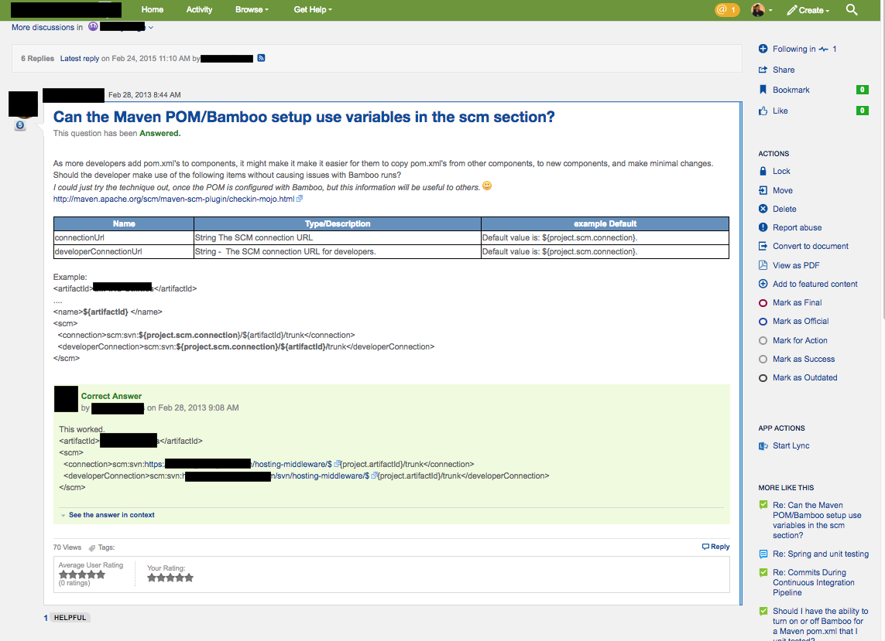
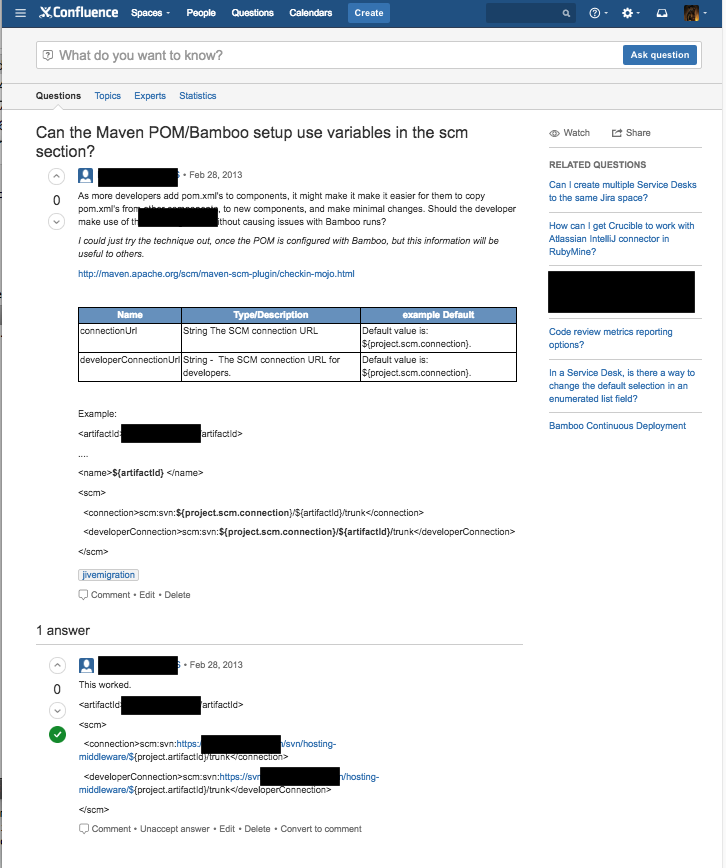

#Jive to Confluence Questions migrator

Ports any Discussions marked as Questions in Jive over to Confluence Questions.

## In Jive


## Results in Confluence



## Install python and Request library

```
brew install python
pip install requests
```

## Create key

If running locally you could tear out encryption, otherwise script assumes AES key was used to output hex encoded value for passwords.

1. encrypt values needed for Jive and Conluence
2. Place ciphers in config/config.js for the appropriate environment
3. Pass path to key and enivronment name to main script

```
#!/bin/bash
ENCKEY="YOUR.KEY.BYTES.HERE" ENVNAME="test" python jiveToConfluence.py
```
